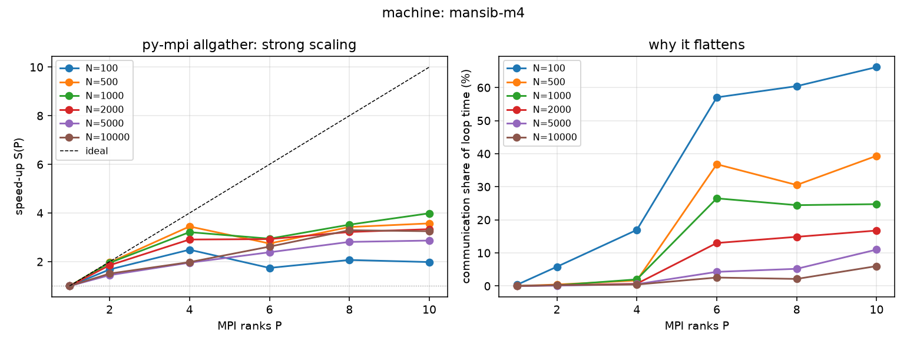
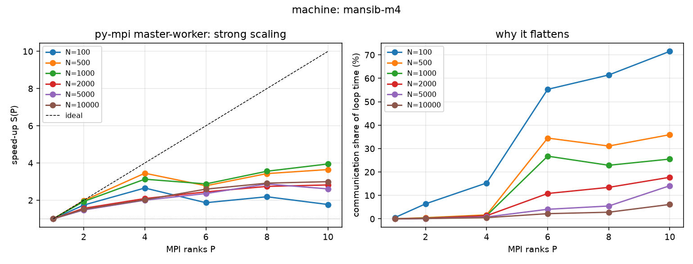
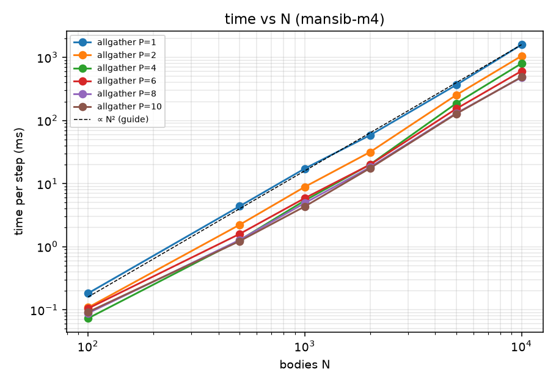

# MPI benchmark report: `mansib-m4`

Generated 2026-09-28 22:08 by `backends/mpi/summarize_mpi.py` from 312 timed runs (warm-up runs excluded).

## Setup

| | |
|---|---|
| Backend | `py-mpi` (mpi4py, velocity Verlet, block decomposition, one exchange per step) |
| Machine tag | `mansib-m4` |
| Host(s) | Nuruls-MacBook-Air.local (1 node) |
| OS / Python | Windows 10 / Python 3.12.13 (report-generation machine) |
| MPI | Open MPI 5.0.11 |
| Steps per run / dt | 100 / 0.1 day |
| Timing | median of repeats, `t_loop_s / steps`, slowest rank; warm-up r0 dropped |

## Key findings

- **N = 100:** best speed-up **2.49× at P = 4**; at P = 10 it is 1.98× with 66% of the time in communication. Speed-up peaks at P = 4 and then falls, because communication is growing.
- **N = 500:** best speed-up **3.57× at P = 10**; at P = 10 it is 3.57× with 39% of the time in communication. Speed-up is still rising at the largest P, so this N could use more ranks.
- **N = 1000:** best speed-up **3.99× at P = 10**; at P = 10 it is 3.99× with 25% of the time in communication. Speed-up is still rising at the largest P, so this N could use more ranks.
- **N = 2000:** best speed-up **3.34× at P = 10**; at P = 10 it is 3.34× with 17% of the time in communication. Speed-up is still rising at the largest P, so this N could use more ranks.
- **N = 5000:** best speed-up **2.87× at P = 10**; at P = 10 it is 2.87× with 11% of the time in communication. Speed-up is still rising at the largest P, so this N could use more ranks.
- **N = 10000:** best speed-up **3.29× at P = 8**; at P = 10 it is 3.25× with 6% of the time in communication. Speed-up peaks at P = 8 and then falls, because communication is growing.
- **master-worker vs allgather:** master-worker takes 1.01× the time of allgather (median over all N and P > 1). On one machine the two are close; the gap should grow on a cluster, where rank 0's double job crosses the network.

## Graphs

## Tables

S = speed-up vs P = 1 (same variant, same N); E = S/P; comm % includes waiting for slower ranks; spread = (max − min)/median over repeats (run-to-run noise).

### allgather, N = 100

| P | ms/step | speed-up S | efficiency E | comm % | Karp–Flatt | repeats | spread |
|---:|---:|---:|---:|---:|---:|---:|---:|
| 1 | 0.182 | 1.00 | 1.00 | 0.4 |  | 5 | 3% |
| 2 | 0.108 | 1.68 | 0.84 | 5.8 | 0.191 | 5 | 1% |
| 4 | 0.073 | 2.49 | 0.62 | 17.0 | 0.202 | 5 | 7% |
| 6 | 0.104 | 1.74 | 0.29 | 57.0 | 0.488 | 5 | 6% |
| 8 | 0.088 | 2.07 | 0.26 | 60.4 | 0.409 | 5 | 10% |
| 10 | 0.092 | 1.98 | 0.20 | 66.2 | 0.449 | 5 | 19% |

Amdahl fit: serial fraction **s ≈ 0.382** (maximum possible speed-up ≈ 2.6×)

### allgather, N = 500

| P | ms/step | speed-up S | efficiency E | comm % | Karp–Flatt | repeats | spread |
|---:|---:|---:|---:|---:|---:|---:|---:|
| 1 | 4.361 | 1.00 | 1.00 | 0.0 |  | 5 | 1% |
| 2 | 2.218 | 1.97 | 0.98 | 0.4 | 0.017 | 5 | 11% |
| 4 | 1.265 | 3.45 | 0.86 | 1.7 | 0.053 | 5 | 3% |
| 6 | 1.587 | 2.75 | 0.46 | 36.8 | 0.237 | 5 | 1% |
| 8 | 1.273 | 3.42 | 0.43 | 30.5 | 0.191 | 5 | 6% |
| 10 | 1.221 | 3.57 | 0.36 | 39.4 | 0.200 | 5 | 28% |

Amdahl fit: serial fraction **s ≈ 0.164** (maximum possible speed-up ≈ 6.1×)

### allgather, N = 1000

| P | ms/step | speed-up S | efficiency E | comm % | Karp–Flatt | repeats | spread |
|---:|---:|---:|---:|---:|---:|---:|---:|
| 1 | 17.293 | 1.00 | 1.00 | 0.0 |  | 5 | 1% |
| 2 | 8.863 | 1.95 | 0.98 | 0.2 | 0.025 | 5 | 3% |
| 4 | 5.380 | 3.21 | 0.80 | 2.0 | 0.082 | 5 | 4% |
| 6 | 5.871 | 2.95 | 0.49 | 26.5 | 0.207 | 5 | 2% |
| 8 | 4.910 | 3.52 | 0.44 | 24.4 | 0.182 | 5 | 5% |
| 10 | 4.335 | 3.99 | 0.40 | 24.7 | 0.167 | 5 | 4% |

Amdahl fit: serial fraction **s ≈ 0.153** (maximum possible speed-up ≈ 6.5×)

### allgather, N = 2000

| P | ms/step | speed-up S | efficiency E | comm % | Karp–Flatt | repeats | spread |
|---:|---:|---:|---:|---:|---:|---:|---:|
| 1 | 58.398 | 1.00 | 1.00 | 0.0 |  | 5 | 0% |
| 2 | 31.531 | 1.85 | 0.93 | 0.2 | 0.080 | 5 | 3% |
| 4 | 20.062 | 2.91 | 0.73 | 0.7 | 0.125 | 5 | 0% |
| 6 | 19.945 | 2.93 | 0.49 | 13.0 | 0.210 | 5 | 3% |
| 8 | 18.135 | 3.22 | 0.40 | 14.9 | 0.212 | 5 | 2% |
| 10 | 17.506 | 3.34 | 0.33 | 16.8 | 0.222 | 5 | 4% |

Amdahl fit: serial fraction **s ≈ 0.188** (maximum possible speed-up ≈ 5.3×)

### allgather, N = 5000

| P | ms/step | speed-up S | efficiency E | comm % | Karp–Flatt | repeats | spread |
|---:|---:|---:|---:|---:|---:|---:|---:|
| 1 | 366.183 | 1.00 | 1.00 | 0.0 |  | 3 | 1% |
| 2 | 253.460 | 1.44 | 0.72 | 0.1 | 0.384 | 3 | 1% |
| 4 | 186.933 | 1.96 | 0.49 | 0.6 | 0.347 | 3 | 2% |
| 6 | 153.445 | 2.39 | 0.40 | 4.3 | 0.303 | 3 | 1% |
| 8 | 130.191 | 2.81 | 0.35 | 5.2 | 0.263 | 3 | 1% |
| 10 | 127.668 | 2.87 | 0.29 | 11.0 | 0.276 | 3 | 1% |

Amdahl fit: serial fraction **s ≈ 0.301** (maximum possible speed-up ≈ 3.3×)

### allgather, N = 10000

| P | ms/step | speed-up S | efficiency E | comm % | Karp–Flatt | repeats | spread |
|---:|---:|---:|---:|---:|---:|---:|---:|
| 1 | 1591.206 | 1.00 | 1.00 | 0.0 |  | 3 | 1% |
| 2 | 1053.769 | 1.51 | 0.76 | 0.3 | 0.324 | 3 | 4% |
| 4 | 803.050 | 1.98 | 0.50 | 0.4 | 0.340 | 3 | 0% |
| 6 | 607.677 | 2.62 | 0.44 | 2.6 | 0.258 | 3 | 2% |
| 8 | 483.223 | 3.29 | 0.41 | 2.1 | 0.204 | 3 | 2% |
| 10 | 489.274 | 3.25 | 0.33 | 6.0 | 0.231 | 3 | 3% |

Amdahl fit: serial fraction **s ≈ 0.258** (maximum possible speed-up ≈ 3.9×)

### master-worker, N = 100

| P | ms/step | speed-up S | efficiency E | comm % | Karp–Flatt | repeats | spread |
|---:|---:|---:|---:|---:|---:|---:|---:|
| 1 | 0.191 | 1.00 | 1.00 | 0.6 |  | 5 | 1% |
| 2 | 0.110 | 1.74 | 0.87 | 6.4 | 0.149 | 5 | 1% |
| 4 | 0.072 | 2.66 | 0.66 | 15.3 | 0.169 | 5 | 6% |
| 6 | 0.102 | 1.87 | 0.31 | 55.3 | 0.442 | 5 | 7% |
| 8 | 0.087 | 2.19 | 0.27 | 61.4 | 0.380 | 5 | 6% |
| 10 | 0.108 | 1.77 | 0.18 | 71.5 | 0.517 | 5 | 35% |

Amdahl fit: serial fraction **s ≈ 0.373** (maximum possible speed-up ≈ 2.7×)

### master-worker, N = 500

| P | ms/step | speed-up S | efficiency E | comm % | Karp–Flatt | repeats | spread |
|---:|---:|---:|---:|---:|---:|---:|---:|
| 1 | 4.390 | 1.00 | 1.00 | 0.0 |  | 5 | 1% |
| 2 | 2.217 | 1.98 | 0.99 | 0.5 | 0.010 | 5 | 1% |
| 4 | 1.272 | 3.45 | 0.86 | 1.7 | 0.053 | 5 | 1% |
| 6 | 1.581 | 2.78 | 0.46 | 34.5 | 0.232 | 5 | 1% |
| 8 | 1.279 | 3.43 | 0.43 | 31.1 | 0.190 | 5 | 7% |
| 10 | 1.203 | 3.65 | 0.36 | 35.9 | 0.193 | 5 | 6% |

Amdahl fit: serial fraction **s ≈ 0.161** (maximum possible speed-up ≈ 6.2×)

### master-worker, N = 1000

| P | ms/step | speed-up S | efficiency E | comm % | Karp–Flatt | repeats | spread |
|---:|---:|---:|---:|---:|---:|---:|---:|
| 1 | 17.308 | 1.00 | 1.00 | 0.0 |  | 5 | 1% |
| 2 | 8.950 | 1.93 | 0.97 | 0.3 | 0.034 | 5 | 2% |
| 4 | 5.529 | 3.13 | 0.78 | 1.4 | 0.093 | 5 | 5% |
| 6 | 6.015 | 2.88 | 0.48 | 26.8 | 0.217 | 5 | 1% |
| 8 | 4.864 | 3.56 | 0.44 | 22.9 | 0.178 | 5 | 2% |
| 10 | 4.382 | 3.95 | 0.39 | 25.5 | 0.170 | 5 | 8% |

Amdahl fit: serial fraction **s ≈ 0.158** (maximum possible speed-up ≈ 6.3×)

### master-worker, N = 2000

| P | ms/step | speed-up S | efficiency E | comm % | Karp–Flatt | repeats | spread |
|---:|---:|---:|---:|---:|---:|---:|---:|
| 1 | 58.451 | 1.00 | 1.00 | 0.0 |  | 5 | 1% |
| 2 | 37.338 | 1.57 | 0.78 | 0.2 | 0.278 | 5 | 5% |
| 4 | 27.965 | 2.09 | 0.52 | 1.3 | 0.305 | 5 | 7% |
| 6 | 23.872 | 2.45 | 0.41 | 10.8 | 0.290 | 5 | 1% |
| 8 | 21.305 | 2.74 | 0.34 | 13.4 | 0.274 | 5 | 2% |
| 10 | 20.712 | 2.82 | 0.28 | 17.8 | 0.283 | 5 | 8% |

Amdahl fit: serial fraction **s ≈ 0.286** (maximum possible speed-up ≈ 3.5×)

### master-worker, N = 5000

| P | ms/step | speed-up S | efficiency E | comm % | Karp–Flatt | repeats | spread |
|---:|---:|---:|---:|---:|---:|---:|---:|
| 1 | 387.976 | 1.00 | 1.00 | 0.0 |  | 3 | 1% |
| 2 | 262.706 | 1.48 | 0.74 | 0.1 | 0.354 | 3 | 3% |
| 4 | 193.816 | 2.00 | 0.50 | 0.8 | 0.333 | 3 | 3% |
| 6 | 164.432 | 2.36 | 0.39 | 4.1 | 0.309 | 3 | 1% |
| 8 | 134.985 | 2.87 | 0.36 | 5.5 | 0.255 | 3 | 8% |
| 10 | 148.726 | 2.61 | 0.26 | 14.1 | 0.315 | 3 | 3% |

Amdahl fit: serial fraction **s ≈ 0.305** (maximum possible speed-up ≈ 3.3×)

### master-worker, N = 10000

| P | ms/step | speed-up S | efficiency E | comm % | Karp–Flatt | repeats | spread |
|---:|---:|---:|---:|---:|---:|---:|---:|
| 1 | 1471.985 | 1.00 | 1.00 | 0.0 |  | 3 | 0% |
| 2 | 973.737 | 1.51 | 0.76 | 0.1 | 0.323 | 3 | 2% |
| 4 | 727.301 | 2.02 | 0.51 | 0.5 | 0.325 | 3 | 5% |
| 6 | 566.856 | 2.60 | 0.43 | 2.2 | 0.262 | 3 | 1% |
| 8 | 504.397 | 2.92 | 0.36 | 2.8 | 0.249 | 3 | 0% |
| 10 | 491.027 | 3.00 | 0.30 | 6.1 | 0.260 | 3 | 5% |

Amdahl fit: serial fraction **s ≈ 0.275** (maximum possible speed-up ≈ 3.6×)

## How to read this

- **Speed-up S(P)** = time with 1 rank ÷ time with P ranks. Ideal is S = P.
- **Efficiency E** = S/P. 1.0 means no wasted ranks.
- **comm %** is the share of loop time inside the position exchange, including waiting for the slowest rank at that synchronisation point. When it grows, speed-up flattens.
- **Karp–Flatt** is the serial fraction measured at each P. If it rises with P, overhead (communication, synchronisation) is growing.
- **Amdahl s**: if a fraction s of the work cannot be parallelised, the speed-up can never exceed 1/s.

Reproduce: `python backends/mpi/sweep_local.py --machine mansib-m4` then `python backends/mpi/summarize_mpi.py --machine mansib-m4 --report`.
